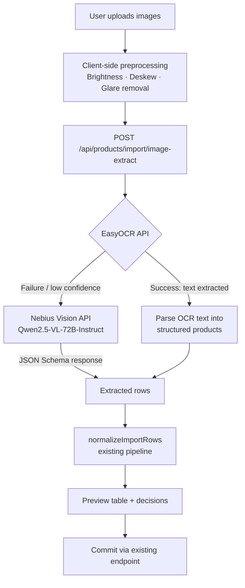

# Image-Based Batch Product Import — Implementation Plan (v2)

## Overview

Add an **image upload** path to the existing batch product import flow. Users upload photos of price lists, catalog pages, or product sheets. The system uses a **two-tier extraction strategy**: **EasyOCR API first** for text extraction + structured parsing, falling back to **Nebius Qwen2.5-VL-72B-Instruct** vision model only when OCR fails. Extracted data feeds into the existing preview → commit pipeline.

> [!IMPORTANT]
> Images are **never persisted** — not in the database, not in Supabase Storage. They exist only in memory during the extraction request and are discarded immediately after processing.

---

## Architecture



---

## Key Design Decisions

| Decision | Choice | Rationale |
|---|---|---|
| Extraction strategy | **EasyOCR first → Nebius Vision fallback** | OCR is faster/cheaper; Vision LLM handles complex layouts |
| Vision model | Nebius `Qwen/Qwen2.5-VL-72B-Instruct` | OpenAI-compatible API, strong multilingual vision |
| Structured output | JSON Schema in `response_format` | Forces valid JSON matching product schema |
| Image storage | **None — images stay in memory only** | Privacy & storage cost; no DB or bucket persistence |
| Image preprocessing | Client-side Canvas API | Brightness/contrast, deskew, glare removal before upload |
| Multi-image | Up to 5 images per request | Covers multi-page catalogs; keeps token budget reasonable |
| Integration point | Feeds into existing `normalizeImportRows` | Reuses all validation, duplicate detection, category logic |
| Confidence scores | Per-field confidence from model | Lets UI highlight uncertain extractions for user review |
| Processing mode | Synchronous with loading indicator | Simple UX; no background job queue needed |

---

## Phase 1: Image Preprocessing (Client-Side)

### File: `features/product-import/helpers/image-preprocess.ts`

Preprocessing happens **in the browser** using the Canvas API before uploading to the server. This improves OCR and vision model accuracy without requiring server-side image libraries.

#### Operations

1. **Brightness/Contrast Adjustment** — Fix poorly lit or overexposed photos
2. **Skew/Deskew Correction** — Straighten tilted table images
3. **Glare & Shadow Removal** — Eliminate uneven lighting that distorts text

> [!NOTE]
> No rotation or cropping. Content is mostly text-based, and cropping risks cutting off text.

```typescript
export interface PreprocessOptions {
  brightness: number;    // 1.0 = unchanged, >1 brighter
  contrast: number;      // 1.0 = unchanged, >1 more contrast
  deskew: boolean;       // Auto-detect and correct skew
  deglare: boolean;      // Reduce glare/shadow artifacts
}

/**
 * Preprocess an image file using Canvas API.
 * Returns a new Blob (JPEG, quality 0.92) with adjustments applied.
 * Original file is NOT modified.
 */
export async function preprocessImage(
  file: File,
  options?: Partial<PreprocessOptions>
): Promise<Blob> { ... }

/**
 * Apply brightness & contrast via Canvas filter.
 */
function applyBrightnessContrast(
  ctx: CanvasRenderingContext2D,
  width: number,
  height: number,
  brightness: number,
  contrast: number
): void { ... }

/**
 * Detect skew angle from text lines using edge detection heuristic.
 * Rotates canvas to correct.
 */
function deskewImage(
  ctx: CanvasRenderingContext2D,
  width: number,
  height: number
): void { ... }

/**
 * Reduce glare by normalizing brightness hotspots.
 * Uses adaptive thresholding on the luminance channel.
 */
function removeGlare(
  ctx: CanvasRenderingContext2D,
  width: number,
  height: number
): void { ... }
```

---

## Phase 2: Backend — Two-Tier Extraction API

### Route: `POST /api/products/import/image-extract`

**File:** `apps/web/app/api/products/import/image-extract/route.ts`

```
Input:  multipart/form-data with 1-5 preprocessed image files
Output: same shape as preview response (rows, warnings, errors, etc.)
```

#### Extraction Flow

```typescript
async function extractProducts(imageBuffers: Buffer[], mimeTypes: string[]) {
  // ── Tier 1: EasyOCR ──
  try {
    const ocrResults = await Promise.all(
      imageBuffers.map((buf, i) => callEasyOCR(buf, mimeTypes[i]))
    );
    const allText = ocrResults.map(r => r.text).join("\n");

    if (allText.trim().length > 50) {
      const products = parseOCRTextToProducts(allText);
      if (products.length > 0) {
        return { products, source: "easyocr" as const };
      }
    }
  } catch (err) {
    console.warn("EasyOCR failed, falling back to Vision LLM:", err);
  }

  // ── Tier 2: Nebius Vision LLM (fallback) ──
  const products = await callNebiusVision(imageBuffers, mimeTypes);
  return { products, source: "nebius-vision" as const };
}
```

#### Tier 1: EasyOCR API

```typescript
async function callEasyOCR(buffer: Buffer, mimeType: string) {
  const formData = new FormData();
  formData.append("file", new Blob([buffer], { type: mimeType }), "image.jpg");

  const response = await fetch("https://console.easyocr.org/api/ocr", {
    method: "POST",
    headers: {
      "X-Access-Key": process.env.EASYOCR_API_KEY!,
    },
    body: formData,
  });

  if (!response.ok) throw new Error(`EasyOCR returned ${response.status}`);
  return await response.json();
}
```

#### OCR Text → Structured Products Parser

```typescript
/**
 * Parse raw OCR text into structured product objects.
 * Handles common Indonesian price list formats:
 *   - "Kertas A4 80gsm    Rp 55.000"
 *   - "1. Tinta Epson L3150 | 89000 | pcs"
 *   - Tabular layouts with columns
 *
 * Returns empty array if text doesn't look like product data.
 */
export function parseOCRTextToProducts(text: string): ExtractedProduct[];
```

Uses pattern matching for:
- Price patterns: `Rp`, `IDR`, `Rp.`, Indonesian number format (`55.000`)
- Tabular patterns: pipe-delimited, tab-delimited, column-aligned text
- Line-by-line extraction with heuristic field detection

#### Tier 2: Nebius Vision LLM (Fallback)

```typescript
import OpenAI from "openai";

const client = new OpenAI({
  baseURL: "https://api.tokenfactory.nebius.com/v1/",
  apiKey: process.env.NEBIUS_API_KEY,
});

const response = await client.chat.completions.create({
  model: "Qwen/Qwen2.5-VL-72B-Instruct",
  messages: [
    { role: "system", content: SYSTEM_PROMPT },
    {
      role: "user",
      content: [
        { type: "text", text: "Extract all products from these images." },
        ...imageContents, // { type: "image_url", image_url: { url: "data:image/jpeg;base64,..." } }
      ],
    },
  ],
  response_format: {
    type: "json_schema",
    json_schema: {
      name: "product_extraction",
      strict: true,
      schema: PRODUCT_EXTRACTION_SCHEMA,
    },
  },
  temperature: 0.1,
  max_tokens: 8192,
});
```

#### JSON Schema for Structured Output

```json
{
  "type": "object",
  "properties": {
    "products": {
      "type": "array",
      "items": {
        "type": "object",
        "properties": {
          "name": { "type": "string" },
          "sku": { "type": "string" },
          "category": { "type": "string" },
          "price": { "type": "number" },
          "stock": { "type": "number" },
          "unit": { "type": "string" },
          "costPrice": { "type": ["number", "null"] },
          "description": { "type": ["string", "null"] },
          "size": { "type": ["string", "null"] },
          "material": { "type": ["string", "null"] },
          "confidence": {
            "type": "object",
            "properties": {
              "name": { "type": "number" },
              "price": { "type": "number" },
              "sku": { "type": "number" }
            }
          }
        },
        "required": ["name", "sku", "category", "price", "stock", "unit"]
      }
    }
  },
  "required": ["products"]
}
```

#### System Prompt

```
You are a product data extraction assistant for an Indonesian print shop
and stationery store (Toko Percetakan & ATK).

Extract ALL products visible in the image(s). For each product:
- name: Product name exactly as shown
- sku: Product code if visible; otherwise generate a short code
  (e.g., "KRT-A4-80" for "Kertas A4 80gsm")
- category: Classify into: Alat Tulis, Kertas, Tinta, Jasa Cetak,
  Amplop, Map, Perlengkapan, or a fitting category
- price: Selling price in IDR (number only, no currency symbol)
- stock: Stock count if visible, otherwise 0
- unit: pcs, rim, box, lembar, meter, roll, pack, lusin, kodi, set
- costPrice: Cost/purchase price if visible
- size: Physical size if mentioned (A4, F4, 3x2m, etc.)
- material: Material if mentioned (Flexi 280gr, Art Paper 150gsm, etc.)
- confidence: 0.0-1.0 for name, price, sku accuracy

Handle Indonesian text. Prices may use dots as thousands separator
(e.g., 25.000 = 25000).
```

---

## Phase 3: Dependencies & Environment

### New dependency
```bash
cd apps/web && pnpm add openai
```

### Environment variables

```env
# .env.local
NEBIUS_API_KEY=your_nebius_api_key_here
EASYOCR_API_KEY=your_easyocr_api_key_here
```

Add to `.env.example`:
```env
NEBIUS_API_KEY=        # Nebius AI API key for vision-based product extraction (fallback)
EASYOCR_API_KEY=       # EasyOCR API key for primary text extraction from images
```

---

## Phase 4: Frontend — UI Changes

### Modified Import Flow

Current: `Upload → Map Columns → Preview → Result`

New: `**Choose Method** → (Image: Upload Photos | File: Upload File) → ... → Preview → Result`

#### Step 0: Method Selection (new component)

**File:** `features/product-import/components/MethodSelector.tsx`

```
┌─────────────────────────────────────────┐
│  How would you like to import?          │
│                                         │
│  ┌─────────────┐  ┌─────────────────┐   │
│  │ 📷 From     │  │ 📄 From File    │   │
│  │ Image       │  │ (CSV/Excel)     │   │
│  │             │  │                 │   │
│  │ AI extracts │  │ Standard column │   │
│  │ product     │  │ mapping flow    │   │
│  │ data from   │  │                 │   │
│  │ photos      │  │                 │   │
│  └─────────────┘  └─────────────────┘   │
└─────────────────────────────────────────┘
```

#### Image Upload Step

**File:** `features/product-import/components/ImageUploadStep.tsx`

```
┌──────────────────────────────────────────────┐
│  Upload Product Images                       │
│                                              │
│  ┌──────────────────────────────────────┐    │
│  │  Drop images here or click to browse │    │
│  │  📷  Up to 5 images (JPG, PNG, WebP) │    │
│  │      Max 5MB each                    │    │
│  └──────────────────────────────────────┘    │
│                                              │
│  Thumbnails:  [img1] [img2] [img3]  [×]      │
│                                              │
│  ⚙️ Preprocessing:                           │
│  [✓] Auto-enhance brightness & contrast      │
│  [✓] Straighten skewed text                  │
│  [✓] Remove glare & shadows                  │
│                                              │
│  💡 Works best with clear photos of:         │
│     • Price lists and catalogs               │
│     • Product labels with prices             │
│     • Supplier invoices                      │
│                                              │
│  [Back]                    [Extract Products] │
└──────────────────────────────────────────────┘
```

#### Extraction Loading State (synchronous)

```
┌──────────────────────────────────────────────┐
│  🤖 Extracting product data...              │
│                                              │
│  ████████████░░░░░░░░  60%                   │
│                                              │
│  Step 1/3: Preprocessing images...      ✓    │
│  Step 2/3: Running OCR extraction...    ⏳   │
│  Step 3/3: Validating results...        ○    │
│                                              │
│  Using: EasyOCR  (or "Using: AI Vision"      │
│  if OCR failed and fell back)                │
└──────────────────────────────────────────────┘
```

#### Enhanced Preview Table (confidence indicators)

Add a **confidence column** when source is image extraction:

| Row | Product | SKU | Price | Confidence |
|-----|---------|-----|-------|------------|
| 1 | Kertas A4 80gsm | KRT-A4-80 | 55,000 | 🟢 High |
| 2 | Tinta Epson L3150 | TNT-??? | 89,000 | 🟡 Medium |
| 3 | ???  | ??? | 12.5 | 🔴 Low |

- **🟢 Green (≥0.8):** High confidence
- **🟡 Yellow (0.5–0.8):** Review recommended
- **🔴 Red (<0.5):** Likely incorrect, requires manual fix

Inline editing: clicking any cell allows user to correct extracted values before commit.

---

## Phase 5: Types

### Updates to `features/product-import/types.ts`

```typescript
export type ImportMethod = "file" | "image";
export type ImportStep = "method" | "upload" | "image-upload" | "mapping" | "preview" | "result";

export type ExtractionSource = "easyocr" | "nebius-vision";

export interface FieldConfidence {
  name: number;   // 0.0 - 1.0
  price: number;
  sku: number;
}

export interface ExtractedProduct {
  name: string;
  sku: string;
  category: string;
  price: number;
  stock: number;
  unit: string;
  costPrice?: number | null;
  description?: string | null;
  size?: string | null;
  material?: string | null;
  confidence: FieldConfidence;
}

export interface ImageExtractResponse {
  rows: NormalizedImportRow[];
  extractedProducts: ExtractedProduct[];
  source: ExtractionSource;
  warnings: string[];
  errors: string[];
  existingSkuMatches: Array<{ sku: string; productId: string; name: string }>;
  missingCategories: string[];
  imageCount: number;
  processingTimeMs: number;
}
```

---

## Phase 6: Hooks

### New: `features/product-import/hooks/useImageExtract.ts`

```typescript
export function useImageExtract() {
  return useMutation({
    mutationFn: async (files: File[]) => {
      const formData = new FormData();
      files.forEach((f, i) => formData.append(`image_${i}`, f));
      const res = await fetch("/api/products/import/image-extract", {
        method: "POST",
        body: formData,
      });
      const data = await res.json();
      if (!res.ok) throw new Error(data.message);
      return data as ImageExtractResponse;
    },
  });
}
```

---

## File Changes Summary

| Action | File | Description |
|--------|------|-------------|
| **Create** | `app/api/products/import/image-extract/route.ts` | Two-tier extraction API (OCR → Vision) |
| **Create** | `features/product-import/helpers/image-preprocess.ts` | Client-side brightness, deskew, deglare |
| **Create** | `features/product-import/helpers/image-extract.ts` | Schema, prompt, OCR parser, Nebius client |
| **Create** | `features/product-import/helpers/sku-generator.ts` | Auto-SKU generation from product name |
| **Create** | `features/product-import/hooks/useImageExtract.ts` | React Query mutation hook |
| **Create** | `features/product-import/components/ImageUploadStep.tsx` | Image upload UI with preprocessing toggles |
| **Create** | `features/product-import/components/MethodSelector.tsx` | File vs Image method selection |
| **Modify** | `features/product-import/types.ts` | Add image-related types |
| **Modify** | `features/product-import/components/ProductImportDrawer.tsx` | Integrate method selection + image flow |
| **Modify** | `.env.example` | Add `NEBIUS_API_KEY`, `EASYOCR_API_KEY` |
| **Install** | `openai` package | For Nebius API client |

---

## Accuracy Techniques

1. **Two-tier extraction** — EasyOCR (fast/cheap) first, Vision LLM only as fallback
2. **Client-side preprocessing** — Brightness/contrast, deskew, glare removal before upload
3. **JSON Schema `response_format`** with `strict: true` — Guarantees valid output shape
4. **Low temperature (0.1)** — Minimizes hallucination in vision model
5. **Domain-specific system prompt** — Indonesian stationery/print shop context
6. **Per-field confidence scores** — UI highlights uncertain data for review
7. **Indonesian price normalization** — Handles `25.000` → `25000`
8. **Post-extraction Zod validation** — Same schema as CSV/Excel import
9. **OCR text parser** — Pattern matching for common Indonesian price list formats
10. **Images never persisted** — Memory-only processing, discarded after extraction

---

## Implementation Order

```
 1. Install `openai` dependency
 2. Add NEBIUS_API_KEY + EASYOCR_API_KEY to env
 3. Create image-preprocess.ts (client-side Canvas preprocessing)
 4. Create image-extract.ts (schema, prompt, OCR parser, Nebius client)
 5. Create sku-generator.ts
 6. Create API route (two-tier: EasyOCR → Nebius fallback)
 7. Create useImageExtract hook
 8. Create MethodSelector component
 9. Create ImageUploadStep component (with preprocessing toggles)
10. Modify ProductImportDrawer to support both flows
11. Add confidence indicators to preview table
12. Add inline cell editing for image-extracted rows
13. Test with real product images
```

---

## Non-Goals (v1)

- ~~OCR fallback~~ → OCR is now primary, Vision is fallback
- Rotation (content is mostly text)
- Cropping (risks cutting text)
- Background/async processing queue
- Training or fine-tuning models
- Barcode scanning from images
- Persisting images to database or storage
