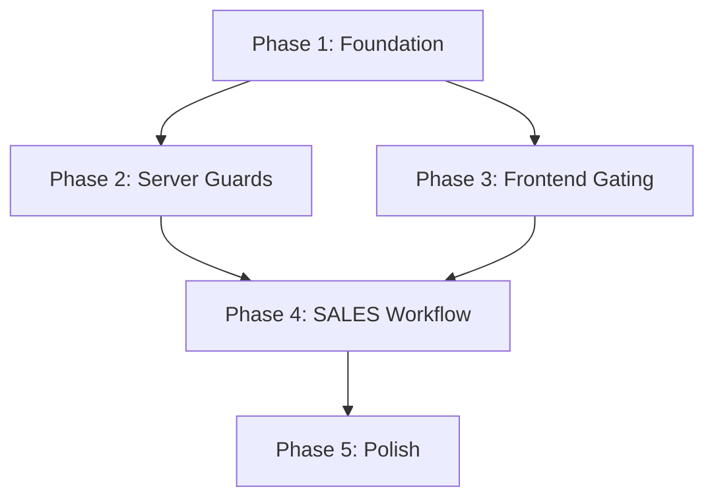

# RBAC Implementation Plan

> **Based on:** [rbac_design.md](file:///C:/Users/Unknown/.gemini/antigravity/brain/e649135b-80c3-481d-93fd-1737cb104a59/artifacts/rbac_design.md)  
> **Approach:** Phased, incremental — each phase is independently deployable  
> **Estimated tasks:** 18 tasks across 5 phases

---

## Phase 1: Foundation (Schema + RBAC Core)
> **Goal:** Schema migration + permission system files. No behavioral changes yet.

- [ ] **1.1** Update Prisma schema: rename `MANAGER` → `SALES` in Role enum
- [ ] **1.2** Update Prisma schema: add `PENDING_APPROVAL` to TransactionStatus enum
- [ ] **1.3** Update Prisma schema: add `requestedById` field + named relations on Transaction/User
- [ ] **1.4** Create migration SQL and run `prisma migrate dev`
- [ ] **1.5** Create `lib/rbac/permissions.ts` — PAGE_ACCESS, ACTION_ACCESS maps, helper functions
- [ ] **1.6** Create `lib/rbac/guard.ts` — `requireRole()`, `AuthError` class
- [ ] **1.7** Update `packages/db/src/seed.ts` — seed users with all 4 roles for testing

> **Checkpoint:** `prisma migrate` succeeds, seed runs, permission map importable with no errors.

---

## Phase 2: Server-Side Enforcement (Middleware + API Guards)
> **Goal:** Lock down every API route + middleware page gating. This is the security-critical phase.

- [ ] **2.1** Enhance `utils/supabase/middleware.ts` — role resolution, `x-pos-role` cookie, PAGE_ACCESS checks
- [ ] **2.2** Add `requireRole()` to `api/dashboard/route.ts` → `OWNER, ADMIN`
- [ ] **2.3** Add `requireRole()` to `api/products/route.ts` + `api/products/[id]/route.ts` → `OWNER, ADMIN`
- [ ] **2.4** Add `requireRole()` to `api/inventory/route.ts` → `OWNER, ADMIN`
- [ ] **2.5** Add `requireRole()` to `api/salespersons/route.ts` + `api/salespersons/[id]/route.ts` → `OWNER, ADMIN`
- [ ] **2.6** Add `requireRole()` to `api/shifts/route.ts` → `OWNER, ADMIN, CASHIER`
- [ ] **2.7** Add `requireRole()` to `api/settings/store/route.ts` → `OWNER, ADMIN`
- [ ] **2.8** Add `requireRole()` to `api/transactions/route.ts` — differentiate SALES (read-only) from others
- [ ] **2.9** Add `requireRole()` to `api/customers/route.ts` + `api/customers/[id]/route.ts` — all 4 roles read/write

> **Checkpoint:** Login as CASHIER → try to access `/api/products` → get 403. Login as ADMIN → get 200.

---

## Phase 3: Frontend Gating (Sidebar + UI Conditionals)
> **Goal:** Users only see what they can access. No broken UI states.

- [ ] **3.1** Create `providers/RoleProvider.tsx` — read `x-pos-role` cookie, expose `useRole()` hook
- [ ] **3.2** Wrap app in `RoleProvider` inside `app/providers.tsx`
- [ ] **3.3** Update `Sidebar.tsx` — filter `navGroups` by role using `PAGE_ACCESS`
- [ ] **3.4** Add "unauthorized" fallback page (`app/(main)/unauthorized/page.tsx`) — shown if someone manually navigates to a blocked page
- [ ] **3.5** Update POS page — detect SALES role, swap "Bayar" → "Ajukan Transaksi", hide payment fields
- [ ] **3.6** Update History page — SALES sees read-only view (no edit/void/refund buttons)
- [ ] **3.7** Update Production page — SALES sees read-only view (no status change buttons)

> **Checkpoint:** Login as SALES → sidebar shows only POS, History, Production, Customers. POS shows "Ajukan Transaksi" button.

---

## Phase 4: SALES Request Workflow (New Feature)
> **Goal:** SALES can submit transaction requests, Cashier can approve/reject.

- [ ] **4.1** Create `POST /api/transactions/request` — SALES-only endpoint that creates PENDING_APPROVAL transaction (no stock decrement)
- [ ] **4.2** Update POS page SALES flow — "Ajukan Transaksi" calls the request endpoint instead of normal transaction creation
- [ ] **4.3** Update History page — add "Menunggu Persetujuan" filter tab with pending count badge
- [ ] **4.4** Create `PATCH /api/transactions/[id]/approve` — Cashier-only endpoint: validates, processes payment, decrements stock, sets `cashierId`, status → `COMPLETED`
- [ ] **4.5** Create `PATCH /api/transactions/[id]/reject` — Cashier-only endpoint: sets status → `VOIDED`, adds rejection note
- [ ] **4.6** Build approval UI in History page — Cashier opens pending txn, sees items + approve/reject buttons with payment flow
- [ ] **4.7** SALES History view — show status badges (🟡 pending, ✅ approved, 🔴 rejected)

> **Checkpoint:** Full workflow test: SALES submits → appears in Cashier history → Cashier approves with payment → stock decrements → SALES sees ✅.

---

## Phase 5: Polish & Edge Cases
> **Goal:** Production-ready robustness.

- [ ] **5.1** Handle role cookie expiry/tampering — middleware validates cookie against DB if suspicious
- [ ] **5.2** Clear `x-pos-role` cookie on logout (update Sidebar logout + login page)
- [ ] **5.3** Update seed script with realistic test scenarios (pending transactions, mixed roles)
- [ ] **5.4** Add user management page placeholder (if not exists) — OWNER/ADMIN can view users and change roles
- [ ] **5.5** Test all role combinations against all routes — manual or scripted verification

> **Checkpoint:** Full regression — no unauthorized access, no broken UI, no orphaned states.

---

## Dependency Graph

> [!IMPORTANT]
> Phase 2 and Phase 3 can run in parallel after Phase 1.
> Phase 4 requires both Phase 2 and 3 to be complete.

---

## Risk Mitigation

| Risk | Mitigation |
|---|---|
| Existing `MANAGER` users break after migration | Migration SQL renames value in-place, no data loss |
| Forgotten API route without guard | Audit all routes in Phase 2; middleware provides fallback page-level check |
| Cookie tampering (user edits `x-pos-role`) | API routes always verify via `requireRole()` hitting the DB — cookie is for UI convenience only, not security |
| SALES submits duplicate pending requests | Add rate limiting or "you have N pending" warning in UI |
| Cashier and SALES have race condition on same pending txn | Transaction approval uses DB-level optimistic locking (check status is still PENDING_APPROVAL before updating) |
